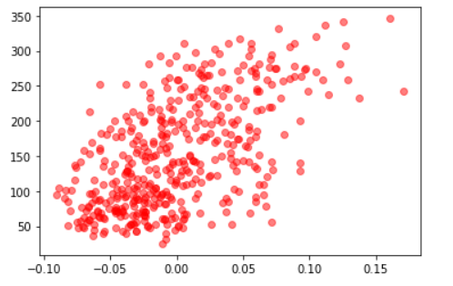
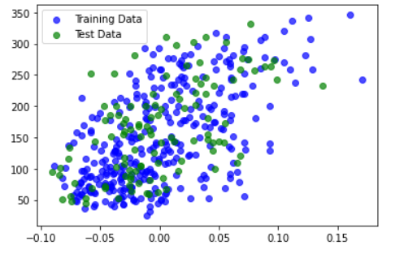
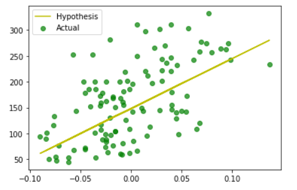

**Importing Packages:**  
```py
import numpy as np  
import pandas as pd  
from sklearn import datasets, linear_model  
from sklearn.metrics import mean_squared_error, r2_score, accuracy_score  
from sklearn.model_selection import train_test_split  
from matplotlib import pyplot as plt  
from pydataset import data  
import seaborn as sns  
```

**Loading data and plotting it(one feature):**
```py
diabetes_X, diabetes_y = datasets.load_diabetes(return_X_y=True)  
diabetes_X = diabetes_X[:, np.newaxis, 2]  
plt.plot(diabetes_X,diabetes_y,'ro',alpha=0.5)
```


**Splitting the dataset into training and testing**
```py
X_train, X_test, Y_train, Y_test = train_test_split(diabetes_X,diabetes_y)
plt.scatter(X_train,Y_train,label='Training Data',color='b',alpha=0.7)
plt.scatter(X_test,Y_test,label='Test Data',color='g',alpha=0.7)
plt.legend()
plt.show()
```


**Training the model with training set and predicting results with test set**
```py
model = linear_model.LinearRegression()
model.fit(X_train,Y_train)

predictions = model.predict(X_test)

plt.plot(X_test,predictions,label='Hypothesis',color='y')
plt.scatter(X_test,Y_test,label='Actual',color='g',alpha=0.7)
plt.legend()
plt.show()
```


**Measuring the performance of the model**
```py
print("Coefficients: \n", model.coef_)
print("Mean squared error: %.2f" % mean_squared_error(Y_test,predictions))
print("Coefficient of determination: %.2f" % r2_score(Y_test,predictions))
```
  
  
**Inference**
The linear regression is a technique to model a given set of data to a corresponding label or quantity such that the model can be used later to predict a new set of data that falls under/similar set to the ones with which the model has been trained. It is generally used to predict a dataset that is distributed continuously over a range.
The object model creates a hypothesis by training using the training set passed to the `fit()` function. Then the predictions are obtained using `predict()`.
In general, the model takes initial parameters/weights that the hypothesis function uses and the cost i.e. the difference between the hypothesis output and actual output is predicted. The cost function J generally given by ` ` is used as a metric to view the current state of the model and J is optimised to minimum so that the cost is minimum. and therefore by updating the parameters/weights while minimizing the cost function, we increase the accuracy of the model and finally at global minimum, we get the final weights of the hypothesis function. Finally for result analysis we find Coefficients, MeanSquaredError and Coefficient of Determination.
