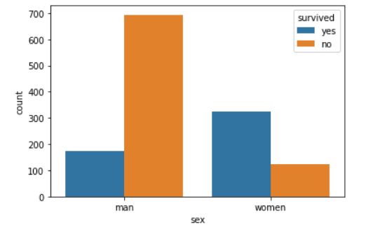
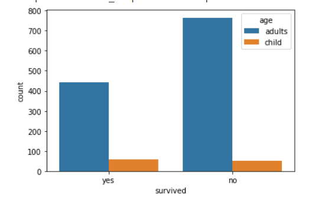
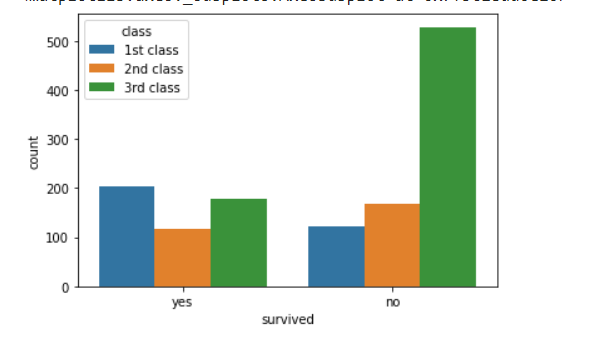
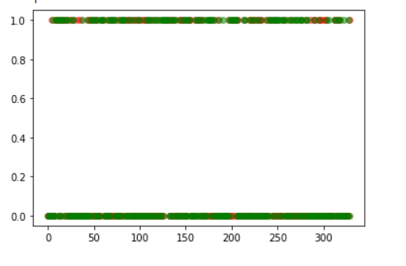

Surviving the Titanic
===
**Importing packages**
```py
import numpy as np  
import pandas as pd  
from sklearn import datasets, linear_model  
from sklearn.metrics import mean_squared_error, r2_score, accuracy_score  
from sklearn.model_selection import train_test_split  
from matplotlib import pyplot as plt  
from pydataset import data  
import seaborn as sns  
```

**Loading dataset**
```py
titanic = data('titanic')
titanic.sample(5)
```


**Plotting the data- Survival based on gender**
```py
sns.countplot(x='sex',hue='survived',data=titanic)
```


**Plotting the data- Survival based on age**
```py
sns.countplot(x='survived',hue='age',data=titanic)
```


**Plotting the data- Survival based on class**
```py
sns.countplot(x='survived',hue='class',data=titanic)
```



**Removing unnecessary/redundant features**
```py
titanic = pd.get_dummies(titanic,drop_first=True)
titanic.sample(5)
```


**Splitting the dataset and training the model**
```py
X_train, X_test, Y_train, Y_test = train_test_split(titanic.drop('survived_yes',axis=1),titanic['survived_yes'])
model2 = linear_model.LogisticRegression(solver='lbfgs')
model2.fit(X_train,Y_train)
```


**Plotting the prediction vs the actual result**
```py
predictions = model2.predict(X_test)
ind = [i for i in range(len(predictions))]
plt.scatter(ind,predictions,color='r',alpha=0.5)
plt.scatter(ind,Y_test, color='g',alpha=0.5)
```


**Scoring the accuracy**
```py
model2.score(X_test,Y_test)
```

The logistic regression is a technique in machine learning for classifying objects into different classes based on certain features. Generally it uses a sigmoid function or similar functions to hypothesize the output based on the input features, in most cases, a output between 0 and 1 which measures the probability of the example fitting in the class 1 or posititve class. The solver lbfgs — Stands for Limited-memory Broyden–Fletcher–Goldfarb–Shanno approximates the second derivative matrix updates with gradient evaluations. It stores only the last few updates, so it saves memory. The solvers are basically used to optimize the cost function in a computationally efficient way.
